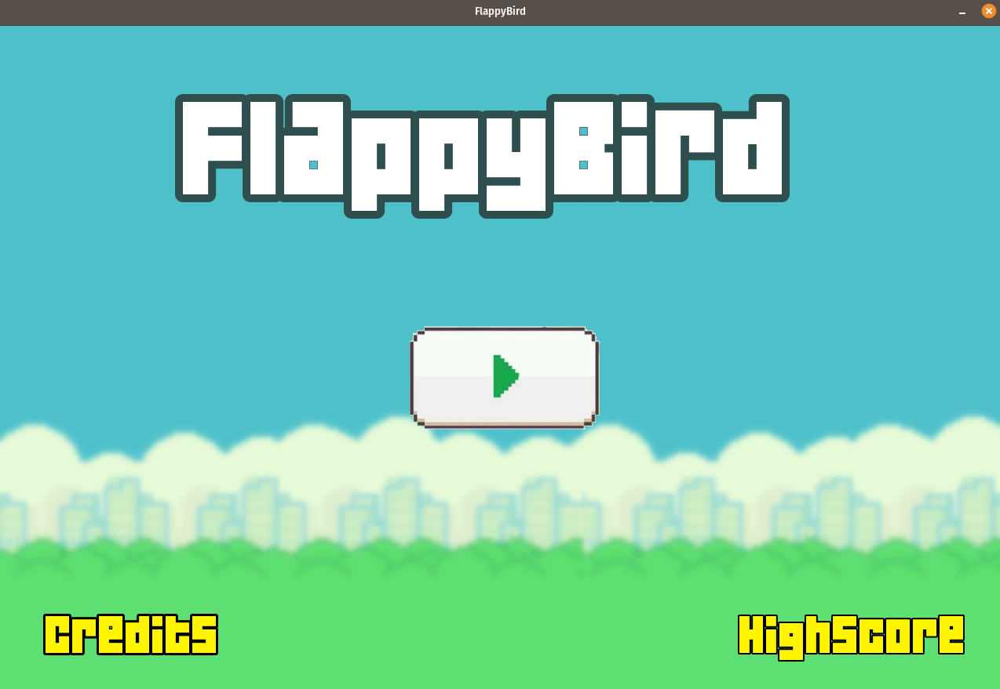
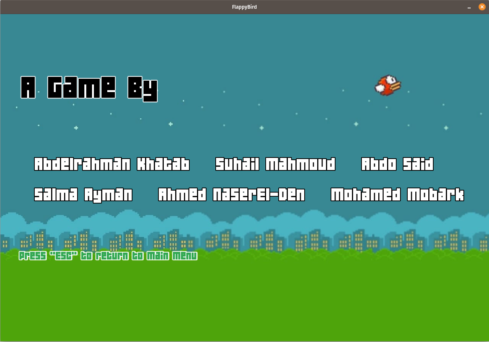
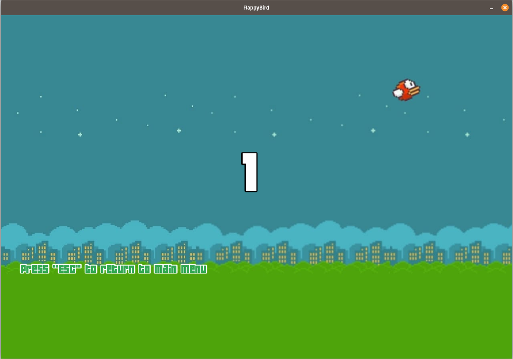
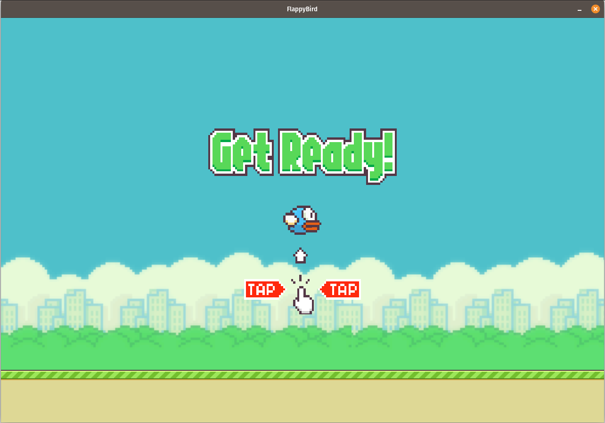
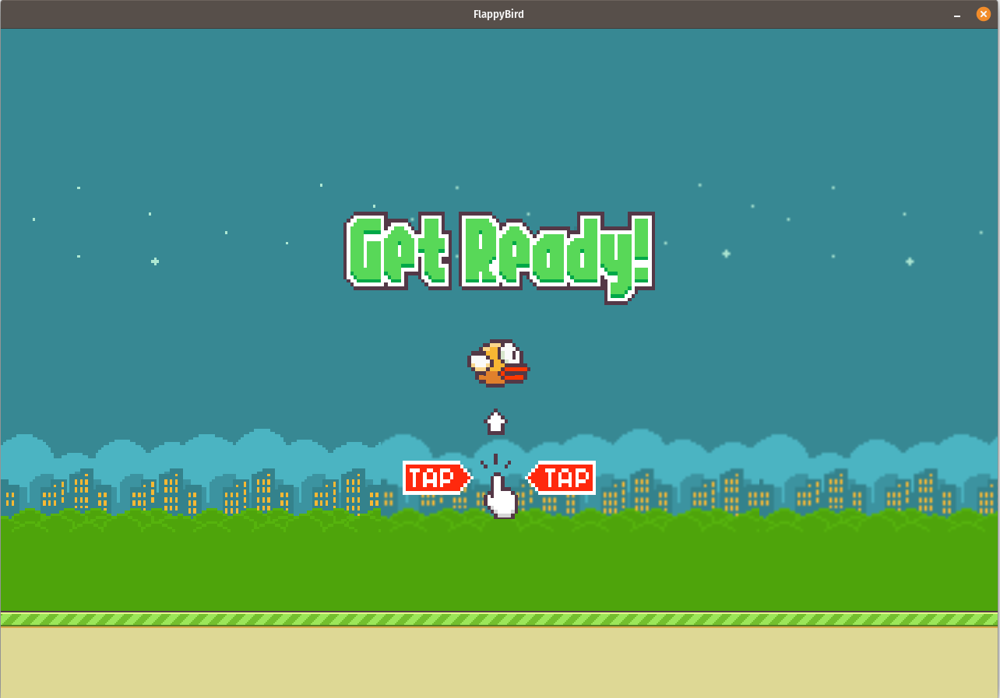
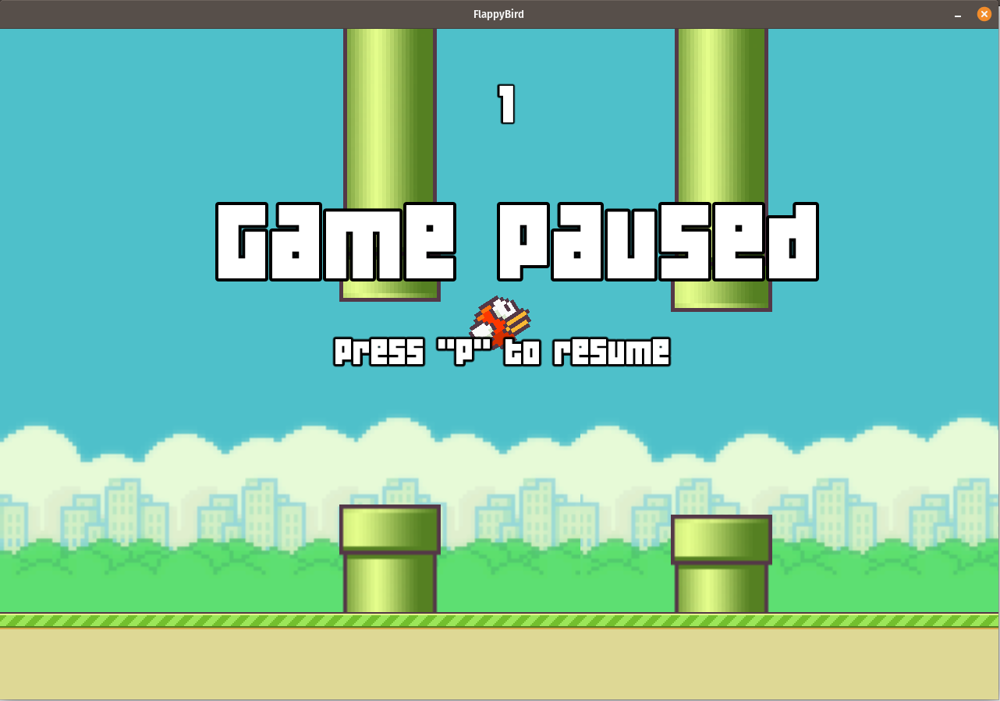
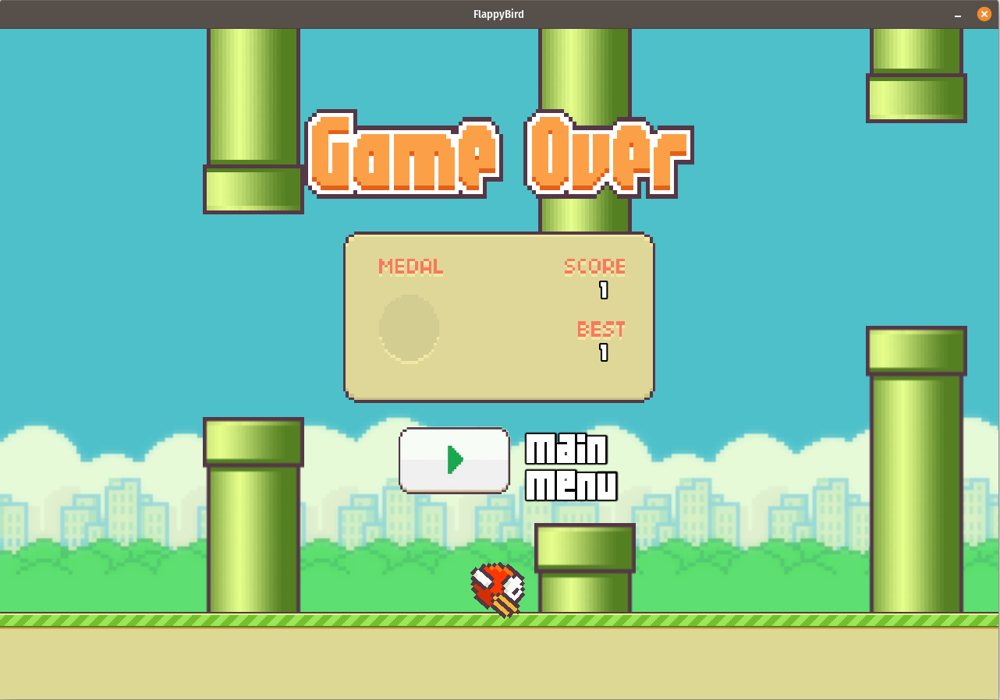
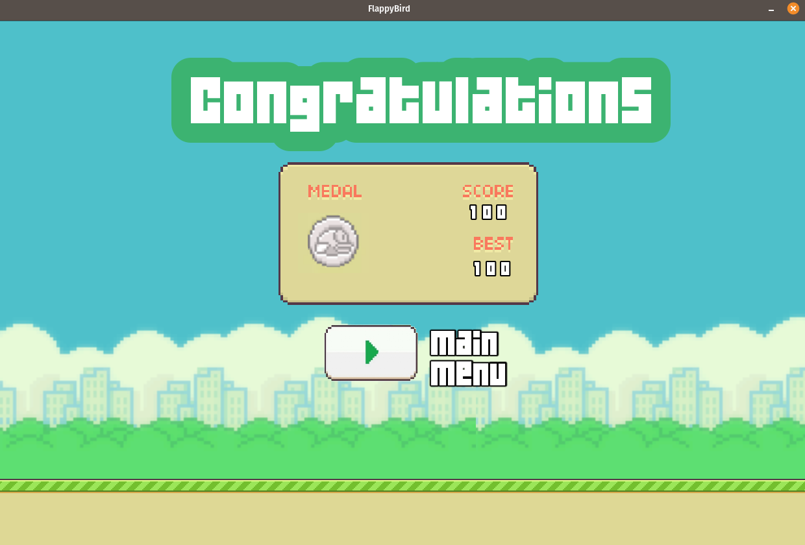

# Flappy Bird - SFML Clone

Flappy bird clone in C++ using the graphics library SFML.

# Description

Flappy Bird is an arcade-style game in which the player controls the bird Faby, which moves persistently to the right.

The player is tasked with navigating Faby through pairs of pipes that have equally sized gaps placed at random heights.

Faby automatically descends and only ascends when the player taps space or click mouse.

Each successful pass through a pair of pipes awards the player one point. 

Colliding with a pipe or the ground ends the gameplay. During the game over screen

# How to install on Linux

- First install SFML :

    `sudo apt-get install libsfml-dev`

- Then execute the following commands:

   `git clone https://github.com/SalmaAlassal/FlappyBird`

    ` cd FlappyBird && rm -rf FlappyBird-Win && cd FlappyBird-Linux`
    
   `g++ main.cpp -lsfml-graphics -lsfml-window -lsfml-system -lsfml-audio `

   `./a.out` 

# How to install on Windows

- Open cmd.exe then execute the following commands :

  `cd C:\Users\Username\Downloads`
  
  **Change the username to your own**

  `git clone https://github.com/SalmaAlassal/FlappyBird`
  
  `cd FlappyBird && rmdir /s  FlappyBird-Linux`

 
- Execute **Flappy Bird.exe** in FlappyBird-Win folder then enjoy your time.

# How to play

- Start the game. Tap the arrow to start. Tap the screen again to allow your bird to fly and to start the game.

- Stay in the middle of screen until the first set of pipes appears. Measure your tap heights to go between the two pipes.

- Stay in the middle of the pipes. This is the main objective of the game. If you hit a pipe or the ground, the game ends.

# When do you win

The bird Faby will win the game if she successful pass through 100 pipes.

# How to pause
   press the **ESC key**.

# How to resume
   press the **p key**.

# Screenshots

Main menu                  
:-------------------------:
|  

Credits                 
:-------------------------:
|  

HighScore 
:-------------------------:
| 

Get Ready 
:-------------------------:
| 

Get Ready
:-------------------------:
|

Pasue
:-------------------------:
|  

Game Over 
:-------------------------:
|

Winner
:-------------------------:
|  

---------------------------------------------

# Team Members

- Salma Ayman
- Suhail Abdel-All
- [Abdelrahman Khatab](https://github.com/AbdelrahmanKhatab9)
- [Abdelrhman Sayed](https://github.com/Abdelrhman-Sayed70)                  
- Ahmed nasr El-Din
- [Mohamed Mobark](https://github.com/mohammadmobaraki)       
